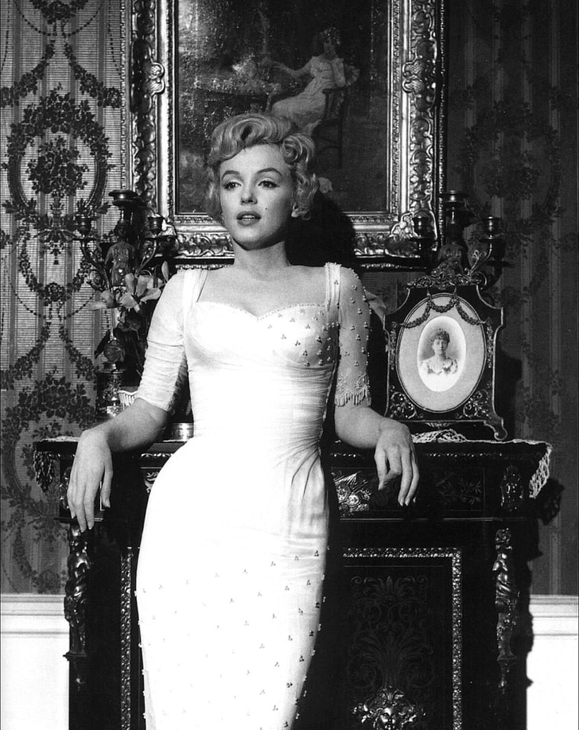
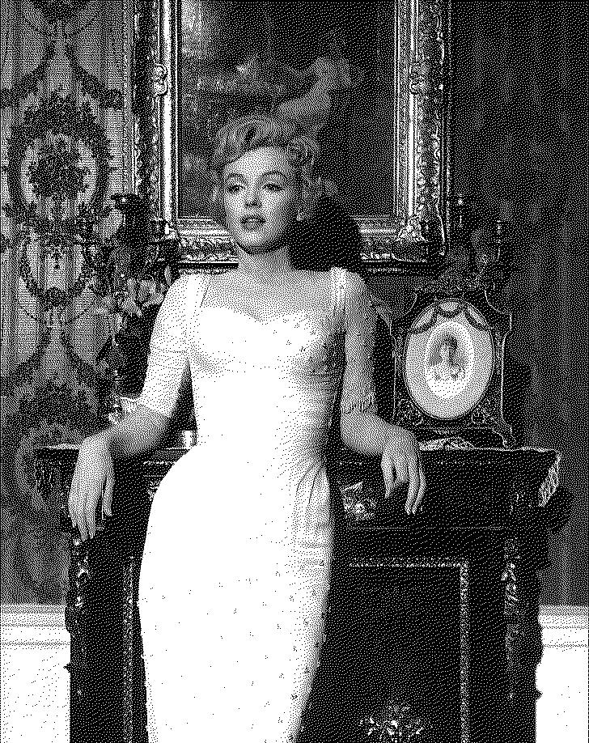

# Signal Probability Analysis

> A practicle implementation of the Floyd–Steinberg dithering algorithm.

This is purely done for my understanding and is NOT intended to be used in production

## Citations

[Book](http://www.dspguide.com/)

Smith, S. W. (1997). The scientist and engineer’s Guide Todigital Signal Processingby Steven W. Smith, ph.D.. The Scientist and Engineer’s Guide to Digital Signal Processing. http://www.dspguide.com/

[Example Image](https://www.pickpik.com/grayscale-photography-marilyn-monroe-actress-fashion-model-61579)

Pik, P. (2017, October). Royalty-Free Photo: Grayscale, photography, Marilyn Monroe, actress, fashion, model, sexy, beauty, icon, retro, celebrity. PickPik. https://www.pickpik.com/grayscale-photography-marilyn-monroe-actress-fashion-model-61579

[Blog](https://scipython.com/blog/floyd-steinberg-dithering/)

christian. (2021, October 13). Floyd-Steinberg Dithering. Floyd-Steinberg dithering. https://scipython.com/blog/floyd-steinberg-dithering/
